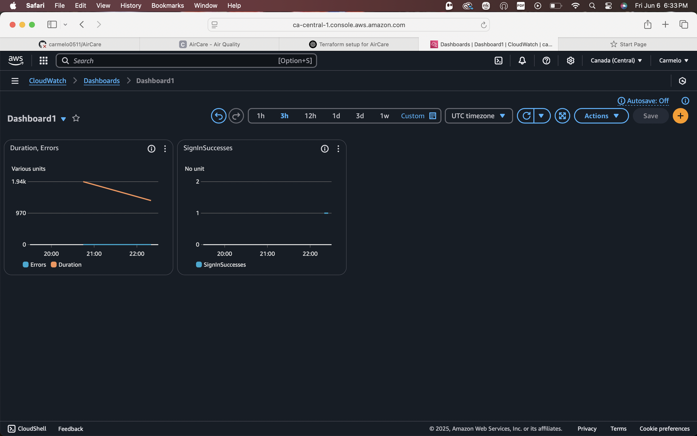
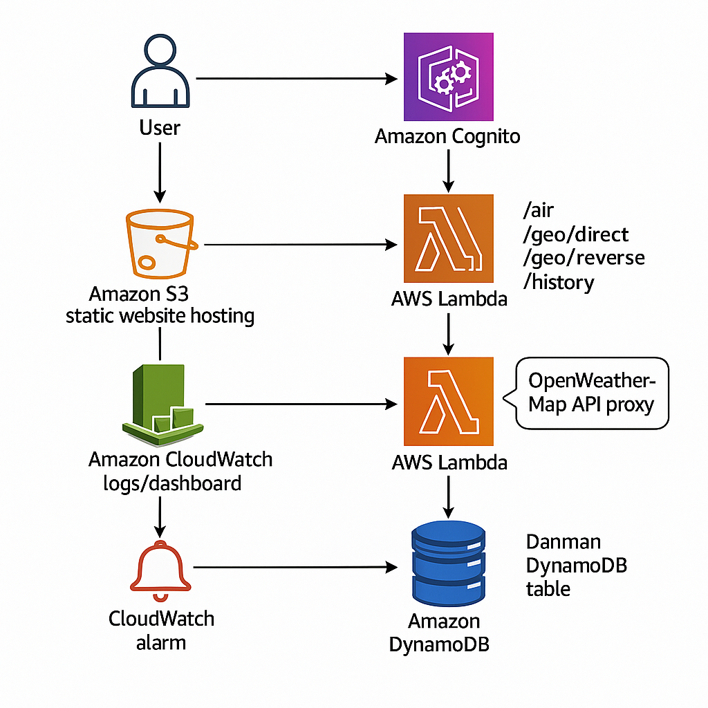

# 🌬️ AirCare

**AirCare** is a cloud-native web application that provides real-time air quality data (AQI) for people with asthma or respiratory sensitivity.  
It leverages a 100% serverless AWS architecture and integrates with the OpenWeatherMap API.

This project is fully automated: every push to GitHub updates both the frontend (S3/CloudFront) and the backend (AWS Lambda) via CI/CD with GitHub Actions. No manual deployments required.

---

## Deployment on CloudFront

The static frontend of AirCare is hosted and distributed via Amazon CloudFront. You can access the live version of the project at:

[https://d1wvrgloixxub.cloudfront.net](https://d1wvrgloixxub.cloudfront.net)

This CloudFront distribution points to the S3 bucket configured to serve all HTML, CSS, JS, and static assets. On every push to the `main` branch, the GitHub Actions workflow automatically:

1. Syncs the local contents of the `frontend/` folder to the S3 bucket.
2. Invalidates the CloudFront cache to ensure the latest changes are served immediately.

---

## DynamoDB AQI History (NEW)

AirCare **persists all AQI lookups** to a DynamoDB table (`AirCareHistoryAQI`).  
Each time a user requests air quality for a city or location, the following data is stored :
- Location (`lat,lon`)
- Timestamp (ISO format)
- AQI value
- Particulate data (PM2.5, PM10, etc.)
- Health advice

A dedicated endpoint (`/history`) allows the frontend to **display the full AQI history** for any location.  
This enables analytics, trends, and potential dashboards (QuickSight integration is the next step).

---

## CloudWatch Dashboard & SNS

Below is a screenshot showing the CloudWatch Dashboard and alarm configuration linked to an SNS topic:



---

## 🧱 Cloud Architecture (diagram)



**Current stack:**

⚡ Frontend: HTML, Tailwind CSS, JavaScript
☁️ Backend: AWS Lambda (Node.js)
🌐 API Gateway: Handles endpoints /air, /geo/direct, /geo/reverse, /history
🗃️ DynamoDB: Stores AQI history for analytics & dashboards
🔒 API key secured (OpenWeatherMap) via Lambda proxy
🔐 Amazon Cognito: Manages user authentication & authorization
🔍 CloudWatch logs for backend observability
⚠️ CloudWatch Alarm + SNS Email alert on Lambda error
📦 S3: Static assets hosting

---

## 🖥️ Backend Lambda

All AWS Lambda source code is included in the [`backend/`](./backend/) folder.

- **Language:** Node.js 18.x (uses AWS SDK v3, native `fetch()`)
- **Endpoints handled:**
  - `/geo/direct` – City autocomplete (OpenWeatherMap API)
  - `/geo/reverse` – Reverse geocoding (coordinates → city)
  - `/air` – Air Quality Index (AQI) for a location or city (stores each lookup in DynamoDB)
  - `/history` – Fetch AQI lookup history from DynamoDB for a specific location
- **Features:**
  - Persists each AQI lookup to DynamoDB (`AirCareHistoryAQI`)
  - Adds tailored health advice for each AQI level
  - Handles errors and logs all requests to CloudWatch
  - Enforces English responses from OpenWeather
  - `/history` decodes and normalizes the `location` parameter for reliable lookups
  - API keys and table names are **never hardcoded** (managed with environment variables)
- **How to deploy:**  
  1. Edit the code in [`backend/index.js`](./backend/index.js)  
 2. Zip the contents of `backend/` and upload to AWS Lambda (or automate via CI/CD). This creates a `lambda.zip` archive in the repository root used for deployment.
 3. See comments in `index.js` for full code explanations

---


## 🚀 Features

- 📍 Automatic geolocation for current city detection
- 🔍 City search with autocompletion
- 💨 Displays air quality index + health advice based on AQI
- 📈 Displays local AQI history (via DynamoDB)
- 📄 Shows a message when no history is available
- 🔐 Secure server-side OpenWeather API access
- 🌐 Clean UI/UX with Tailwind CSS
- 🔑 User authentication powered by Amazon Cognito

---

## 📦 Deployment

This project is fully deployed on **AWS**:

- 🗂️ Static frontend hosted on **S3**
- 🚀 Served via **CloudFront**
- ⚙️ Backend built with **Lambda + API Gateway**
- 🗃️ **AQI history stored in DynamoDB**
- ✅ CI/CD automated with **GitHub Actions**
  - Tests run automatically during deployment
  - Lambda package now includes Node.js dependencies

---

## 📊 Monitoring & Alerts

- 🧠 Structured **CloudWatch logs** on every request
- ⚠️ **CloudWatch Alarm** triggered on ≥ 1 error/minute
- 📧 Email notifications via **SNS**
- 📉 AQI history stored and visualizable via **DynamoDB**

---

## 📂 Project Structure

AirCare/
├── assets1/               # Images & diagrams
│   ├── diagramme1.png
│   └── cloudwatchdashboard.png
├── backend/               # Lambda source code
│   └── tests/             # Backend unit tests
├── frontend/              # HTML/CSS/JavaScript (app.js, auth.js, index.html, style.css)
│   └── config.js          # generated by scripts/set-api-url.js
├── scripts/               # Helper scripts to configure API and Cognito
├── .github/workflows/     # CI/CD with GitHub Actions
├── LICENSE
└── README.md              # This file

---

## Development

### Local setup

1. Install **Node.js 18** or newer.
2. Clone this repository and install the backend dependencies:
   ```bash
   git clone https://github.com/carmelo0511/AirCare.git
   cd AirCare/backend
   npm install
   ```
3. Set your OpenWeatherMap API key in the `OPENWEATHER_APIKEY` environment variable:
   ```bash
   export OPENWEATHER_APIKEY=your_api_key
   ```
4. (Optional) Set the DynamoDB table name used by the Lambda via `TABLE_NAME`.
   If not set, it defaults to **AirCareHistoryAQI**:
   ```bash
   export TABLE_NAME=AirCareHistoryAQI
   ```
5. Run the backend test suite to ensure everything works:
   ```bash
   npm test
   ```
6. Set the API endpoint for the frontend:
   ```bash
   API_BASE_URL=https://i5x97gj43e.execute-api.ca-central-1.amazonaws.com/prod node scripts/set-api-url.js
   ```
   This creates `frontend/config.js`.
7. Generate the Cognito configuration for the frontend:
   ```bash
   COGNITO_REGION=your-region \
   COGNITO_USER_POOL_ID=pool-id \
   COGNITO_USER_POOL_CLIENT_ID=client-id \
   COGNITO_DOMAIN=your-domain.auth.region.amazoncognito.com \
   node scripts/set-cognito-config.js
   ```
   Make sure the **Cognito domain** and callback URLs are correctly configured
   in the AWS console. If they don't match your site URL, the Hosted UI shows
   “Something went wrong. An error was encountered with the requested page.”
   After adjusting the domain or URLs, rerun the script above to regenerate
   `frontend/cognito-config.js`.
8. Serve the frontend locally from the project root. The helper script below
   (re)generates `frontend/config.js` every time so the API endpoint matches
   the `API_BASE_URL` environment variable:
   ```bash
   node scripts/dev-server.js
   ```
   Then open `http://localhost:8080` in your browser.

- **404 for `config.js`** – run `node scripts/dev-server.js` to start the
  server. It will regenerate `frontend/config.js` using `API_BASE_URL` so the
  frontend points to the correct backend.
- **404 for `chart.umd.js`** – ensure you have an internet connection. The
  Chart.js library is loaded from a CDN (see `frontend/index.html`, line 79).
### Changing the API endpoint

If you deploy your own backend or API Gateway, set the `API_BASE_URL` environment variable and run:
```bash
node scripts/set-api-url.js
```
This regenerates `frontend/config.js` with your endpoint. Because the frontend imports this value at runtime, no application code changes are required.

---

## ✅ Security

- The API key is **never exposed** to the client
- AWS IAM roles follow the principle of least privilege
- No secrets hardcoded in the repo (managed via GitHub Secrets)

## 🛠 Infrastructure as Code

Terraform files reside in [`terraform/`](./terraform). Use the helper script to validate the configuration and list managed resources:

```bash
cd terraform
../check_aircare_terraform.sh
```

Ensure a `lambda.zip` exists in the repository root before running the script.


---

## 🚧 Upcoming Improvements

- Additional monitoring and alerting
---

## License

This project is licensed under the [MIT License](./LICENSE).

---

## 🙋 Contact

Bryan Nakache
[LinkedIn](https://www.linkedin.com/in/bryan-nakache-08147b1b7/) • GitHub: [@carmelo0511](https://github.com/carmelo0511)
