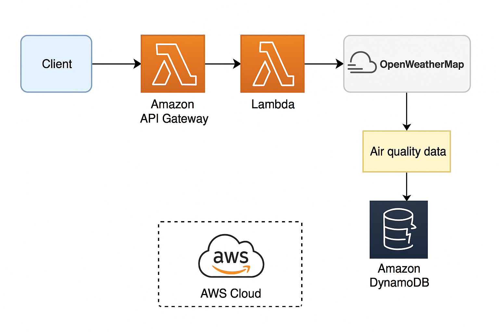

# 🌬️ AirCare

**AirCare** is a cloud-native web application that provides real-time air quality data (AQI) for people with asthma or respiratory sensitivity.  
It leverages a 100% serverless AWS architecture and integrates with the OpenWeatherMap API.

---

## 🧱 Cloud Architecture (diagram)

**Current stack:**

- ⚡ **Frontend**: HTML, Tailwind CSS, JavaScript
- ☁️ **Backend**: AWS Lambda (Node.js)
- 🌐 **API Gateway**: Handles endpoints `/air`, `/geo/direct`, `/geo/reverse`
- 🔒 **API key secured** (OpenWeatherMap) via Lambda proxy
- 🔍 **CloudWatch logs** for backend observability
- ⚠️ **CloudWatch Alarm** + **SNS Email alert** on Lambda error
- 🗃️ **(Planned)**: Store AQI history in **DynamoDB** + visualize with **QuickSight**

---

## 🚀 Features

- 📍 Automatic geolocation for current city detection
- 🔍 City search with autocompletion
- 💨 Displays air quality index + health advice based on AQI
- 🔐 Secure server-side OpenWeather API access
- 🌐 Clean UI/UX with Tailwind CSS

---

## 📦 Deployment

This project is fully deployed on **AWS**:

- 🗂️ Static frontend hosted on **S3**
- 🚀 Served via **CloudFront**
- ⚙️ Backend built with **Lambda + API Gateway**
- ✅ CI/CD automated with **GitHub Actions**

---

## 📊 Monitoring & Alerts

- 🧠 Structured **CloudWatch logs** on every request
- ⚠️ **CloudWatch Alarm** triggered on ≥ 1 error/minute
- 📧 Email notifications via **SNS**
- 🔜 AQI history will be stored in **DynamoDB** for analytics

---

## 📂 Project Structure

AirCare/
├── assets1/ # Images & diagrams
│ └── diagramme.png
├── backend/ # Lambda source code
├── frontend/ # HTML/CSS/JavaScript
├── .github/workflows/ # CI/CD with GitHub Actions
├── README.md # This file

---

## ✅ Security

- The API key is **never exposed** to the client
- AWS IAM roles follow the principle of least privilege
- No secrets hardcoded in the repo (managed via GitHub Secrets)

---

## 🚧 Upcoming Improvements

- 🗃️ Add **DynamoDB** to log user queries and AQI history
- 📊 Build a **QuickSight Dashboard** for AQI trends
- 👥 Integrate **Amazon Cognito** for user authentication
- 📜 Implement API Gateway **usage plans and throttling**

---

## 🙋 Contact

Bryan Nakache  
[LinkedIn](https://www.linkedin.com/in/bryan-nakache) • GitHub: [@carmelo0511](https://github.com/carmelo0511)
