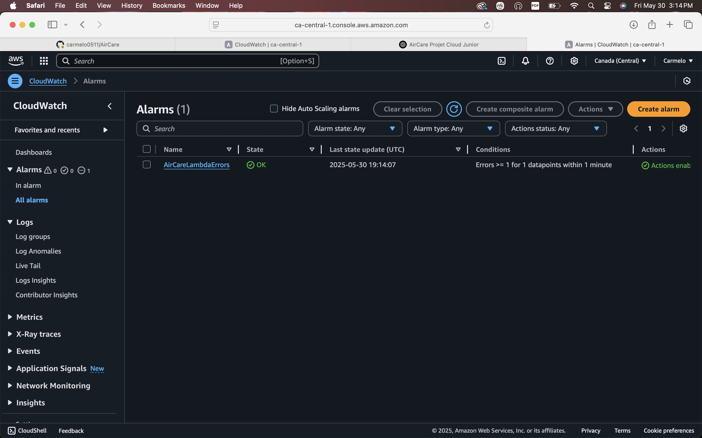

# 🌿 AirCare

[](https://aws.amazon.com/s3/)
[](https://aws.amazon.com/cloudfront/)
[](https://github.com/carmelo0511/AirCare/actions)
[-success?logo=amazon-aws&logoColor=white)](#)
[](#)

---

**AirCare** est une application moderne de suivi de la qualité de l’air en temps réel, pensée pour les asthmatiques et personnes sensibles.  
- Interface moderne (HTML/CSS/Tailwind, JS)
- Autocomplétion des villes, géolocalisation, conseils santé
- 100% Cloud AWS : Lambda/API Gateway (clé API OpenWeather cachée), S3 + CloudFront (hébergement)
- CI/CD automatique avec GitHub Actions

---

## 🚀 **Fonctionnalités**

- Recherche de ville avec suggestions instantanées (autocomplete)
- Géolocalisation et nom de la ville auto
- Indice qualité de l’air (AQI) et recommandations santé
- Interface responsive, rapide, simple
- **Sécurité pro : clé API 100% cachée grâce à AWS Lambda Proxy**

---

## 🛠️ **Stack & Architecture**

- **Frontend** : HTML, Tailwind CSS, Vanilla JS
- **Backend** : AWS Lambda (Node.js 18.x) – proxy multi-endpoints (pollution, autocomplete, reverse geocode)
- **API Gateway** : 3 routes sécurisées : `/air`, `/geo/direct`, `/geo/reverse`
- **Hébergement** : S3 (static website) + CloudFront (cache, HTTPS)
- **CI/CD** : GitHub Actions → S3 (auto sync) + CloudFront (auto invalidation)
- **Sécurité** : la clé OpenWeather n’est jamais visible côté client ou sur GitHub

---

## 🔗 Démo en ligne (CloudFront)

[https://d1wvrgloixxub.cloudfront.net/](https://d1wvrgloixxub.cloudfront.net/)


---

## 🗂️ **Structure du projet**

AirCare/
├── app.js
├── index.html
├── style.css
├── .github/
│ └── workflows/
│ └── deploy-s3.yml
└── README.md


---

## ⚡ **Déploiement automatique (CI/CD)**

À chaque push sur `main` :
1. Le code frontend est déployé automatiquement sur S3 (bucket public static)
2. Le cache CloudFront est invalidé pour servir la dernière version

**Le workflow GitHub Actions utilisé :**

```yaml
name: Deploy to S3 and Invalidate CloudFront

on:
  push:
    branches:
      - main

jobs:
  deploy:
    runs-on: ubuntu-latest
    steps:
      - name: Checkout repository
        uses: actions/checkout@v4

      - name: Sync S3 bucket
        uses: jakejarvis/s3-sync-action@v0.5.1
        with:
          args: --acl public-read --delete
        env:
          AWS_S3_BUCKET: ${{ secrets.AWS_S3_BUCKET }}
          AWS_ACCESS_KEY_ID: ${{ secrets.AWS_ACCESS_KEY_ID }}
          AWS_SECRET_ACCESS_KEY: ${{ secrets.AWS_SECRET_ACCESS_KEY }}
          AWS_REGION: 'ca-central-1'
          SOURCE_DIR: './'

      - name: Invalidate CloudFront cache
        uses: chetan/invalidate-cloudfront-action@v2
        env:
          AWS_ACCESS_KEY_ID: ${{ secrets.AWS_ACCESS_KEY_ID }}
          AWS_SECRET_ACCESS_KEY: ${{ secrets.AWS_SECRET_ACCESS_KEY }}
          DISTRIBUTION: ${{ secrets.CLOUDFRONT_DIST_ID }}
          PATHS: "/*"
NB : Les credentials AWS et le nom du bucket sont configurés dans les GitHub Secrets du repo.
☁️ Architecture cloud

graph TD
A[Utilisateur (Frontend)] -- fetch /air, /geo/direct, /geo/reverse --> B(API Gateway)
B --> C(Lambda Proxy)
C --> D(OpenWeatherMap)
C --> E(Renvoie la data)
B --> A
A -- assets --> S3/CloudFront
🚦 Endpoints API (proxy Lambda)

/air?city=Paris ou /air?lat=43.7&lon=7.3 → pollution pour une ville ou coords
/geo/direct?q=Paris&limit=5 → suggestions villes (autocomplete)
/geo/reverse?lat=43.7&lon=7.3&limit=1 → reverse geocoding (coords → nom ville)
✨ Aperçu


(Insère ici une capture d’écran AirCare)

👨‍💻 Installation locale

Clone ce repo
Ouvre index.html dans ton navigateur
🚀 Déploiement cloud

Uploade tous les fichiers sur S3 (bucket public “static website”)
Pointe une distribution CloudFront vers ton bucket
Ajoute/Configure le workflow GitHub Actions pour automatiser le déploiement
---

## 📊 Monitoring & Alerting

AirCare est monitoré avec **AWS CloudWatch** :

- 🔍 Logs structurés CloudWatch
- ⚠️ Alarme si erreur Lambda
- 📧 Alerte email avec SNS
- 📷 Exemple :




---
## 🔒 **Sécurité**

Aucune clé API dans le frontend ou le repo
Tout passe par un proxy cloud AWS
Droits IAM minimaux pour la CI/CD (S3 + CloudFront)
---
## 🏆 **Conclusion**

Développement cloud moderne (serverless, S3, CloudFront, Lambda)
Sécurité API (clé jamais exposée)
CI/CD automatisé (GitHub Actions)
Responsive design et UX claire

---
📧 Contact

Bryan Nakache
github.com/carmelo0511
